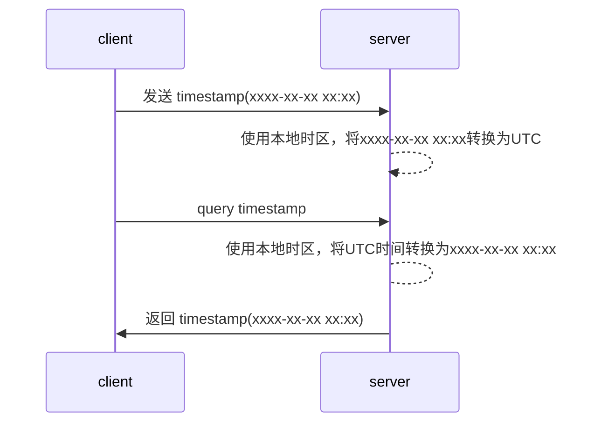

# SQL中的数据类型

SQL标准定义了一些数据类型，所有支持SQL标准的关系型数据库（目前市面上所有主流的关系型数据库都支持该标准）都采用了这些类型。

## 数值类型

### 整数

| Type        | Storage (Bytes) | Minimum Value Signed | Minimum Value Unsigned | Maximum Value Signed | Maximum Value Unsigned |
| ----------- | --------------- | -------------------- | ---------------------- | -------------------- | ---------------------- |
| `TINYINT`   | 1               | `-128`               | `0`                    | `127`                | `255`                  |
| `SMALLINT`  | 2               | `-32768`             | `0`                    | `32767`              | `65535`                |
| `MEDIUMINT` | 3               | `-8388608`           | `0`                    | `8388607`            | `16777215`             |
| `INT`       | 4               | `-2147483648`        | `0`                    | `2147483647`         | `4294967295`           |
| `BIGINT`    | 8               | `-2^63`              | `0`                    | `2^63-1`             | `2^64-1`               |

SQL中的整数与编程语言中的`整数`概念基本一致，区分长度和符号。

整数默认是[有符号的](https://dev.mysql.com/doc/refman/8.0/en/integer-types.html)，需要使用额外的标志来声明无符号。默认情况下，无符号数的运算结果为无符号，这点需要注意。

### 实数

#### 浮点数

sql支持float和double两种[浮点数](https://dev.mysql.com/doc/refman/8.0/en/floating-point-types.html)，分别为4字节长度和8字节长度，与编程语言中的概念相同。

#### 定点数

`NUMERIC`是SQL中的定点数标准，MySQL中使用`DECIMAL`，两者等同。使用NUMERIC时需要指定总长度和小数精度，其最大长度为65：

```
DECIMAL(5,2)
```

如果插入数据的小数精度超过设定，会采取舍入策略，**应当避免插入超过设定精度的数值**。

_相比于浮点数计算存在误差，定点数计算没有误差，在需要精确精度的金融等领域使用。_

## 布尔类型

SQL没有规定布尔类型，习惯用`tinyint(1)`来表示编程语言中的`boolean`类型，0表示false,非`0`表示true。

## 字符串类型

存在不同的字符串类型是因为存在多种维度的区分：

- 是存储变长(variable-length)的序列还是固定长度的序列，它们在底层细节存在很多区别，其中char是用来存储固定长度序列
- 是存储较短长度序列，中等长度序列，还是较长长度的序列，其中char用来存储较短长度的序列，varchar用来存储中等长度的序列，blob用来存储较长长度的序列

### char&varchar

[char](https://dev.mysql.com/doc/refman/8.0/en/char.html)用于存储较短长度的字符序列，varchar用于存储中等长度的字符序列。

`var`是“variable-length”的缩写，`char`类型存储在数据库中的值是固定长度的，原始数据如果小于这个长度会被使用**空格**进行填充，超过则会截断（应当避免这样做）。相对的varchar类型存储在数据库中的值的长度是可变的，不会进行尾部填充。

创建表时，char与varchar都需要指定其允许的最大字符长度，varchar的最大字符长度受到行最大字节大小的限制。

|              | char                               | varchar                                |
| ------------ | ---------------------------------- | -------------------------------------- |
| 抽象意义     | 固定长度字符串                     | 可变长度字符串                         |
| 理论长度范围 | 0~255chars                         | 0~65535bytes                           |
| 尾部填充     | 是                                 | 否                                     |
| 对待尾部空格 | 空格不属于数据                     | 空格属于数据的一部分，会用于存储和检索 |
| 读取         | 因为没有记录长度，直接删除尾部空格 | 按实际长度读取                         |
| 存储前缀     | 不存储长度记录                     | 使用1或2个字节存储字符串实际长度       |

#### char的尾部填充与剥离

为了保证固定长度的存储值，对不满足长度的原始数据进行了尾部填充，在使用（查询、排序、比较）时需要对尾部空格进行剥离，因此`char`类型的`实际值`是**不存在尾部空格的**。

**char仅用于存储固定长度，且无尾部空格的数据，比如手机号码**。

## 字节类型

### binary&varbinary

[binary](https://dev.mysql.com/doc/refman/8.0/en/binary-varbinary.html)用于存储较短长度的字节序列的类型，varbinary用于存储中等长度的字节序列。

binary与varbinary的关系和char与varchar的关系很类似，不同点在于：

- binary&varbinay的长度单位是字节
- binary使用零字节`0x00`进行填充

|                    | binary                                 | varbinay                               |
| ------------------ | -------------------------------------- | -------------------------------------- |
| 抽象意义           | 固定长度字节序列                       | 可变长度字节序列                       |
| 长度范围(字节单位) | 0~255bytes                             | 0~65535bytes                           |
| 尾部填充           | 是                                     | 否                                     |
| 对待尾部零字节     | 0x00不属于数据                         | 0x00属于数据的一部分，会用于存储和检索 |
| 读取               | 因为没有记录实际长度，直接删除尾部0x00 | 按实际长度读取                         |
| 存储前缀           | 不存储长度记录                         | 使用1或2个字节存储长度                 |

### blob&text

[blob](https://dev.mysql.com/doc/refman/8.0/en/blob.html)用于存储长字节序列，text用于存储长字符序列。

根据允许的最大长度不同，blob&text可进一步划分为：

- blob类型包括：TINYBLOB,BLOB,MEDIUMBLOB,LONGBLOB
- text类型包括：TINYTEXT,TEXT,MEDIUMTEXT,LONGTEXT

| 类型                   | 长度                                    |
| ---------------------- | --------------------------------------- |
| TINYBLOB, TINYTEXTOB   | *`L`* + 1 bytes, where *`L`* < $2^8$    |
| BLOB, TEXT             | *`L`* + 2 bytes, where *`L`* < $2^{16}$ |
| MEDIUMBLOB, MEDIUMTEXT | *`L`* + 3 bytes, where *`L`* < $2^{24}$ |
| LONGBLOB, LONGTEXT     | *`L`* + 4 bytes, where *`L`* < $2^{32}$ |

blob,text可以提供可选长度信息，mysql会根据提供的字节长度信息匹配最合适的细分类型，[这里](https://dev.mysql.com/doc/refman/8.0/en/string-type-syntax.html)了解语法细节。

## 时间类型

mysql8提供了多种[时间类型](https://dev.mysql.com/doc/refman/8.0/en/date-and-time-types.html)：

- year,date,time表示时间的部分信息：年、日期（年月日）、时分秒，不带时区信息
- datetime 包含了日期和时分秒，不带时区信息
- timestamp 表示了完整的时间，包括了时区信息

mysql8对timestamp采取以下处理方式：



datetime与timestamp另一个不同点是可表示的有限范围不同。

### 区别datetime与timestamp

由于闰秒、夏令时等因素，给时间带来了很大的复杂性，时间成了需要专家才能弄明白的概念。

这里，我们不研究时间这个复杂概念（也没有这个能力），仅仅区别SQL中的两种时间类型datetime和timestamp。

timestamp源自[unix时间](https://en.wikipedia.org/wiki/Unix_time)，使用有符号32位整数，表示自`1970.1.1 00:00:00 UTC`以来的物理上的秒数。这导致了：

- 只能表示`1970-01-01 00:00:01 UTC`至`2038-01-19 03:14:07 UTC`的时间信息
- 从定义来讲，包含了时区信息

而datetime使用不同的底层表示方法（有待进一步了解），可以表示`1000-01-01 00:00:00`至`9999-12-31 23:59:59`，从语义来讲，其不包括时区信息。

如果不考虑闰秒、夏令时所带来的时间复杂性，时区对于datetime来说并不是一个问题，我们可以约定存入的是UTC时间。

# 参考资料

《SQL学习指南》v2 2.3 MySQL中的数据类型

[doc: mysql8数据类型](https://dev.mysql.com/doc/refman/8.0/en/data-types.html)
