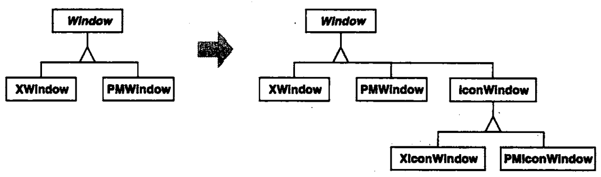
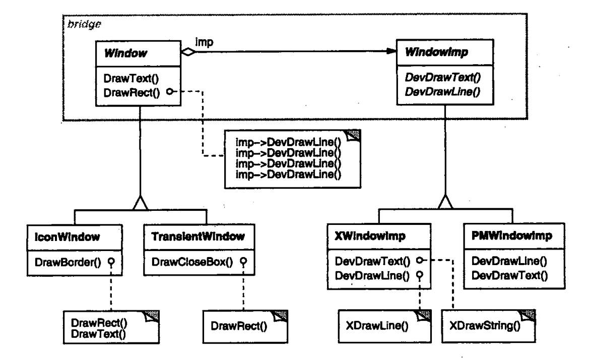
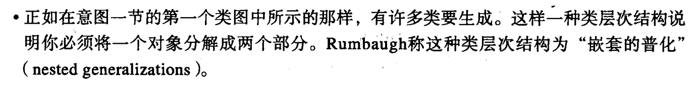

# 什么是桥接模式？

最开始接触桥接模式时很难理解，因为其名称抽象，而且大部分学习资料质量糟糕 ，如《Head First》、各类博客，都没能将桥接模式讲明白，甚至存在理解偏差。比如：

- 《Head First》简单的提及了桥接模式，遥控器和电视机的举例很难理解
- 百度搜索排名靠前的[博客](http://www.cnblogs.com/chenssy/p/3317866.html)，提出了维度说，是一种偏差甚至错误的理解

如果你觉得某些书籍、博客让你困惑，看了以后云里雾里，这是正常的，因为这些普遍是**二手知识**（本文也不例外）。此时正确的方法是查找英文资料和权威来源（官方文档、论文等）。

设计模式的权威来源自然是《Design Patterns》，看看它是怎么介绍桥接模式的：

```
意图：将抽象部分(abstraction)与它的实现部分(implementation)分离，使它们都可以独立的变化。
```

上面的“二手知识”都复制了这段解释，但没能讲明白：**什么是抽象和实现**。该书举例就很清晰的说明了，而且来源于**实际开发场景**：

假设你需要开发一个跨平台(X Window System,PM)的GUI套件，你将定义一套接口，同时你也会为它们提供不同平台下的实现。如：

- 最顶层的抽象类Window，表示窗口，它有两个具体的不同平台的实现类XWindow,PMWindow
- 此时你想新增一个抽象类IconWindow，表示图标窗口，它也有两个具体的不同平台的实现类XIconWindow和PMIconWindow



问题在于：

- 如果以后新增新的窗口抽象，也需要创建两个具体的不同平台实现类
- 如果以后要支持其它平台，必须为每种窗口定义一个新的子类

解决办法是将具体的实现封装到另一个类层次结构中：



在抽象类层次结构中，我们屏蔽掉具体的平台实现，专注于提供一个完整的GUI套件功能。在实现的类层次结构中，包含比较低级的操作，为抽象类层提供底层接口。

至此，我们看到了抽象和实现的具体含义（不要望文生义的与OOP中的抽象类和实现类关联）：

- 抽象 高层API，对不同平台提供一致的API
- 实现 不同平台对高层API的实现提供的底层支持接口

因此我们可以总结：**桥接模式就是用于开发跨平台API时的一种设计模式，它将与具体平台底层相关的操作剥离API所在类层级，并提供统一的底层接口供抽象层以组合的方式使用**。它们就像用桥连接的两岸，广阔且各有风景。

# 什么地方用到桥接模式？

现代编程语言，对不同平台的文件、网络、线程、图形等功能进行了封装，提供了统一的公共库，它们都可以采用桥接模式来实现。

# JDBC中的桥接模式体现在什么地方？

人们普遍认为JDBC采用了桥接模式，但并没有多少人能说清楚其如何体现。

DBMS是服务端程序的重要组成部分，数据库访问编程通常为面向SQL编程，对于采取哪种DBMS并不敏感。如果不同DB提供不同的Java API，编写跨DB程序将存在复杂性。此时可以采取以下应对措施：

- 一种方法是采取如上述GUI API的原始实现，对不同的DB创建不同的类。假设采取3层架构，以User DAO为例，将有MySQLUserDao，MSSQLUserDao，OracleUserDao...这会面临类膨胀的问题。
- 一种方法是创建一个抽象层，假设叫做SQLClient，由该接口提供统一的数据库操作API。提供对不同的DB API进行封装的实现类，如MySQLClient、MSSQLClient、OracleClient...

JDBC采取了第二种方法，帮我们实现了“SQLClient”。采用桥接模式的JDBC，分离了业务逻辑代码（抽象）和数据库客户端代码（实现），使得它们解耦，可以独立的变化，极大提高了跨DBMS应用的可能性，应用程序员几乎可以真正的做到面向SQL编程。

# ”维度说“是否是桥接模式？

百度排名靠前的个人博客喜欢从”维度说“来解释桥接模式，如：

- 红色圆形，绿色矩形，蓝色椭圆，应该拆分为两个维度Shape和Color
- 苹果笔记本，华为手机，小米pad，应该拆分为两个维度Computer和Company

的确，在《Design Patterns》中对桥接模式的适用性中提到：



**将桥接模式对类型拆分为两个类层次进行泛化，确实可以理解为桥接模式的一种适用性。** 但这不属于桥接模式的核心概念，只能算是一种延伸性的理解。

而且这些举例完全脱离了实际开发场景，并不能帮助理解桥接模式，偏离了桥接模式的核心概念：分离实现和抽象。

因此不建议将“维度说”作为桥接模式的正统理解。“维度说”所面临的问题，是如何建立合理的抽象，解决办法是根据需求，确定哪些维度的信息应该作为field存在于类中，而非以子类的方式存在。

# 二手知识的危害

设计模式本身是从实际开发场景总结来的，学习设计模式的关键是找到遵循设计模式的现实代码，才能真正的理解模式的概念和应用场景。而不是一些简单的“Hello World”的代码。

许多书籍、博客会写出自己对知识的理解，如果他们的经验能帮助我们更快速的学习知识，就是好的教材，否则自然是垃圾的**二手知识**。

他们喜欢将知识的原例解构，然后举一个自己的例子，但有些例子完全偏离了原例子的精髓，这就很容易造成理解偏差。如果遇到了很玄乎，不知所以然的举例，就应该远远避之。

对于相对论有一个很出名的故事，爱因斯坦曾经这样向普通人解释相对论：“一位先生和一位漂亮女孩在一起呆上一小时，他会感觉像一分钟；但如果让他在火炉子旁呆上一分钟，他会感觉比一小时还长。这就是相对论。”

我没考证这个故事的真实性，但这只是面向大众的幽默、泛泛而谈的比喻。如果你作为一个研究相对论的理科生，你用这句话去理解相对论，而不是严谨的数学、物理知识的证明，那明显就是错误的。有些二手知识就像爱因斯坦的这个比喻，对于专业的人来说毫无价值。

再如，在某乎上询问“什么是阻塞、非阻塞、同步、异步”，第二个高票答案是：


这种比喻居然也能大行其道，但它能帮助你理解什么是“阻塞、非阻塞、同步、异步”吗，不能，你只会被比喻的内容弄混淆，感觉自己懂了。理解这些根本不需要再加一层毫无意义的比喻。

> 当你确实理解了这些概念，你再去看这些比喻/举例发现其能表达到部分意思，但对于初学者这些比喻只会起误导作用

那要怎么才能理解“什么是阻塞、非阻塞、同步、异步”？很简单，这几个词汇放在一起的地方，是Unix的IO模型，你看看《UNIX环境高级编程》和《UNIX网络编程卷1：套接字联网API》对于IO模型的章节，基本就能理解为什么有这些概念，并放在一起说。

可以看到二手举例/比喻的问题在于：

- 举例太过简单，毫无实际价值。又或者理解存在偏差，导致错误理解。
- 不需要比喻来理解的知识，添加一层毫无意义的比喻，导致学习层次变深，并且转移了学习关注点。

在学习的过程中，一定要辩证性的看待不同学习资料，一般而言，尽量避免二手知识。