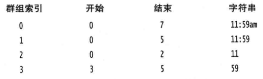

# 使用正则表达式
不同执行环境提供的API细节存在区别，但风格类似。

# compile()
编译时，可以提供可选的标志，一般存在：
- `ignorecase` 默认不忽略大小写，设置该选项将忽略大小写，一般只考虑US-ASCII字符。
- `multiline` `^`,`$`默认匹配string的开头和结尾（忽略行分隔符），设置该选项`$`将允许匹配行分隔符
- `dotall `.`是否可以匹配行分隔符
- `Unicode相关标志` Unicode的引入，对大小写,\s,\d,\w等产生影响，一些标志将决定如何影响

# match()
测试整个string是否与正则表达式相匹配

# find()
查找string中匹配模式的部分

# split()
根据pattern作为分隔标志，将string拆分为多个substring

# group
对于基本的分组而言，`分组0`表示匹配的整个string，而从pattern的第一个左括号开始算起，匹配的部分依次是分组1,2,3,...

分组功能可以用来：

1.我们可以在正则表达式中对前面匹配的内容进行Back引用：

```java
String str1="abab";
String str2="abac";
p=Pattern.compile("([a-z]{2})\\1");//\1表示对前面分组匹配内容的引用
Matcher m1=p.matcher(str1);
Matcher m2=p.matcher(str2);
System.out.println("matches: " + m1.matches());//true
System.out.println("matches: " + m2.matches());//false
```

2.通过索引，我们可以获取匹配的部分内容，如以下模式和输入：

```
模式：((1?[0-9]:([0-5][0-9]))[ap]m
输入：11:59am
```

我们可以通过分组快速的获取带am/pm的时间，时间的数值、时、分部分：



3.还可以利用group特性在替换时引用分组内容，如：
```java
var str = "Hi,good morning.";
var p = Pattern.compile(".*?,(.*?\\.)");
var m = p.matcher(str);
System.out.println(m.replaceFirst("$1"));//good morning.
```
对于替换时使用引用分组的语法，存在区别：
- Java支持使用`$1`
- Python支持使用`\1`
- Notepad++支持使用`$1`或`\1`

# 总结
正则表达式主要用于测试匹配、查找匹配内容、分割字符串功能。

而分组功能对于在正则表达式中引用前面匹配的内容、提取匹配内容的部分、替换时引用部分内容等功能提供了支持。
