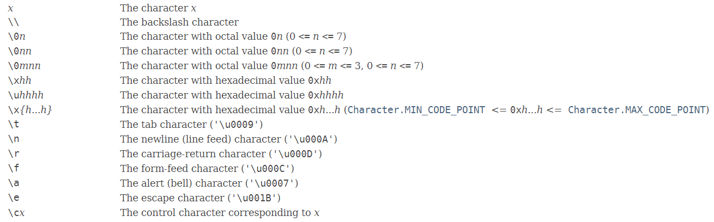
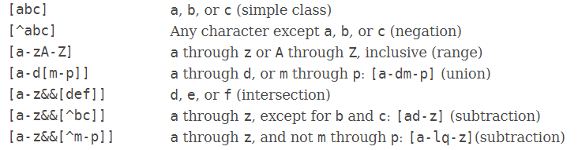
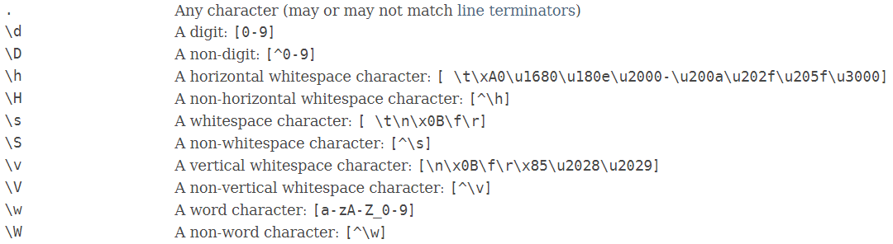
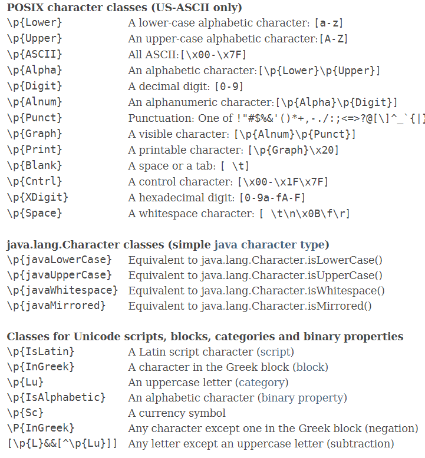
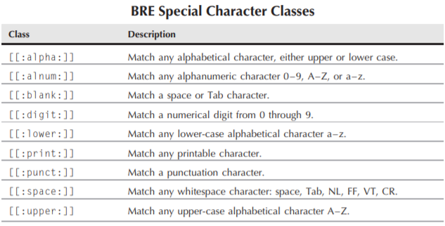
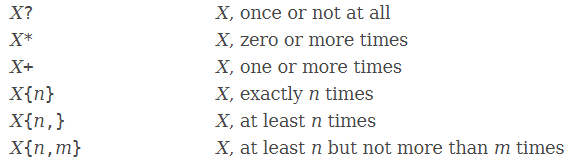
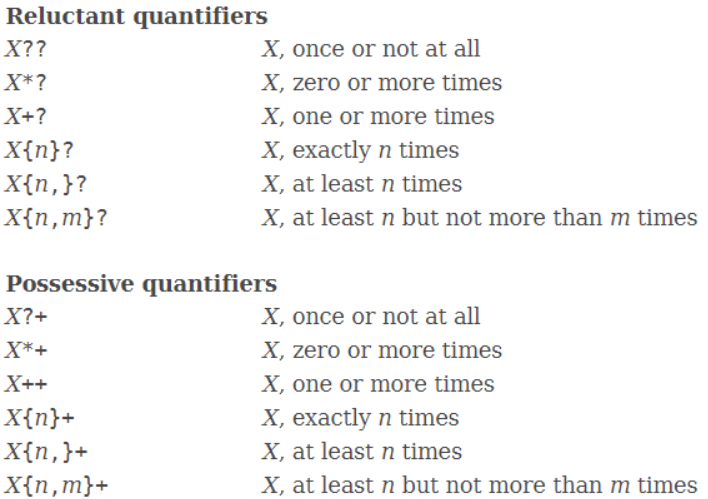
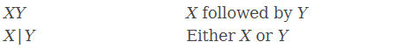

# 基本概念

正则表达式是**用于字符串模式匹配的通用工具**。正则表达式是一段特殊的字符串，使用一种特殊的语法定义模式来帮助匹配其它字符串的全部或部分内容，可用于文本的匹配、搜索和编辑。

# 语法细节

下面以Java的`java.util.regex`包的官方文档为参考，讲解正则表达式的语法细节。

## 字符

字符是正则表达式的基本组成单元。



上述中的转义字符是语言环境Java的转义字符，与正则表达式本身无关。

## 正则表达式转义字符

正则表达式使用`\`作为转义字符，将具有语法作用的符号表示为普通字符，这些符号将在后续中介绍。

## 字符类

表示字符集合中的任意一个字符，具有与单个字符相同的匹配作用，**需要区分其内部语法与正则表达式外部语法**。



字符类由`[]`包裹，它有以下语法：

- 成员默认为`and`的关系，从而组成集合
- 使用`-`符号表示范围，支持小写字母、大写字母、数字
- 起始的`^`表示取集合的补集
- 允许嵌套，通常省略内部的`[]`
- 符号`&&`表示取集合的交集
- 特殊符号`-`,`^`,`&`不满足其语法作用时，会被解释成普通成员字符，也可以使用转义符号`\`将其转义。而`[`,`]`则必需转义。

## 预定义字符类

常用的字符类得到了正则表达式语法的直接支持，包括：



其中最常用的是：
- `.`表示任意字符，除了行分隔符（设置相关标志可以允许匹配行分隔符，行分隔符的内容取决于执行环境和标志）
- `\d`,`\D`表示数字、非数字（大写表示补集，后续类同）
- `\s`,`\S`表示空白、非空白
- `\w`,`\W`表示英文字符、非英文字符

由于Unicode的引入，数字、空白、单词字符的含义被扩展，因此`\d`,`\s`,`\w`的匹配目标在不同人类语言、不同标志下存在区别，详情参阅文档。

其余字符类并非通用，且很少使用。预定义字符类直接使用于正则表达式中，而不需要`[]`。

## 特殊字符类

特殊字符类仅在某些特殊的执行环境中被支持，而且它们的语法形式存在差异，不具备可移植性

如Java所支持的：



或 POSIX BRE引擎所支持的（与Java中所支持的特殊字符类中的第一类相同）：



## 边界匹配符

定义字符串的一些边界情况：



用于匹配行边界、单词边界、字符串边界等，用的最多的是`^`,`$`

`$`默认情况下会忽略字符串中的行分隔符，可以通过设置了相关标志允许其匹配行分隔符

## 量词

定义重复匹配的数量，从而实现更加灵活的匹配


## 量词后缀

量词的默认匹配原则是贪婪的，即尽可能匹配更多的字符，使用后缀`?`可将其转变为非贪婪的



如：
```
<.*>匹配<a> b <c>
而<.*?>仅匹配<a>
```

`+`后缀表示默认的贪婪匹配，没有实际作用，python不支持该符号。

## 集合操作

最简单的正则表达式是由一个字符组成，如果我们想要匹配多个字符，就需要`连接`功能；如果想要匹配多个正则表达式中的任意一个，就需要`or`的功能



## 分组基本操作

```
(X)    X, as a capturing group
\n    Back引用，Whatever the nth capturing group matched
```

将多个正则表达式表示为一个整体，主要有两个作用：
- 使用分组可以将多个内容组成一个整体来使用，比如使用量词，比如使用集合`|`操作
- 可以引用该分组，比如我们需要匹配整个模式但只需要提取部分信息，这将在后续讲解

## 分组高级操作

分组的高级功能，主要包括：
- 命名的捕获分组
- 不捕获的分组
- 通过表达式设置标志（即添加元数据）
- 通过表达式设置分组的标志（即添加元数据）
- 设置正前置匹配(随便翻译，不一定准确，possitive lookahead assertion)
- 设置负前置匹配(...)
- 设置正后置匹配(...)
- 设置负后置匹配(...)

这部分的语法形式和支持功能，不同执行环境略有区别，也很少被使用

## 总结

以上总结了正则表达的语法细节，主要参考了：
- [java: Pattern](https://docs.oracle.com/javase/8/docs/api/java/util/regex/Pattern.html)
- [python: re](https://docs.python.org/zh-cn/3/library/re.html)
- \<\<Java 核心技术 卷2\>\> 1.8 正则表达式
