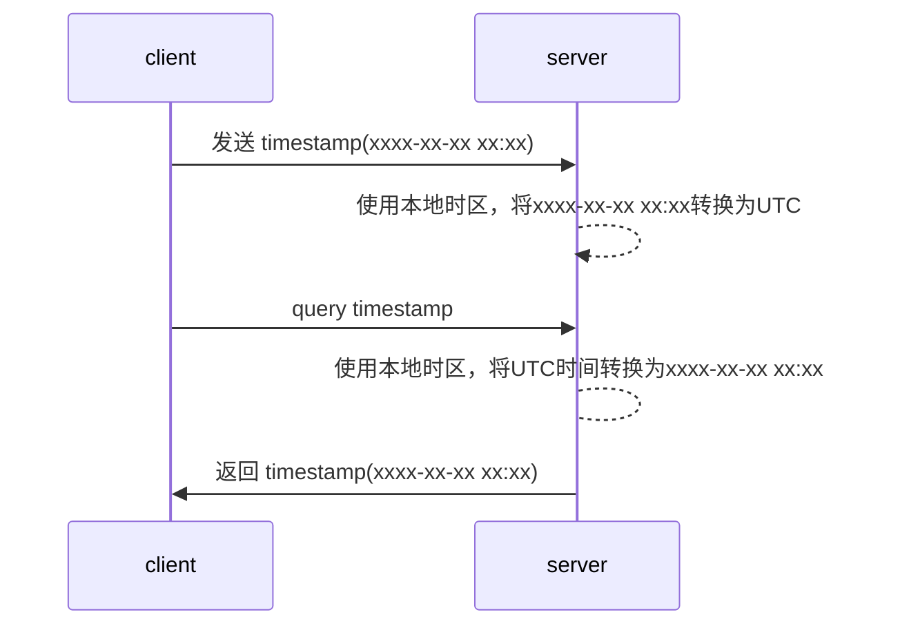

# 数值类型
## 整数

sql中的[整数](https://dev.mysql.com/doc/refman/8.0/en/integer-types.html)与编程语言中的`整数`概念基本一致，区分长度和符号。

整数默认是[有符号的](https://dev.mysql.com/doc/refman/8.0/en/integer-types.html)，需要使用额外的**标志**来声明无符号。注意的是，默认情况下，无符号数的运算结果为无符号，因此除非类似`id`这样不参与算数运算的字段，**应当避免使用无符号数**。

## 实数
### 浮点数

sql支持float和double两种[浮点数](https://dev.mysql.com/doc/refman/8.0/en/floating-point-types.html)，分别为4字节长度和8字节长度，与编程语言中的概念相同。

### 定点数

`NUMERIC`是SQL中的定点数标准，MySQL中使用`DECIMAL`，两者等同。使用NUMERIC时需要指定总长度和小数精度，其最大长度为65：

```
DECIMAL(5,2)
```

如果插入数据的小数精度超过设定，会采取舍入策略，**应当避免插入超过设定精度的数值**。

>相比于浮点数计算存在误差，定点数计算没有误差，在需要精确精度的金融等领域使用。
>
# 字符串类型

SQL中的[字符串类型](https://dev.mysql.com/doc/refman/8.0/en/string-types.html)是统称所有存储**字符序列**或**字节序列**的数据类型。

本文只关心其中常用的：char,varchar,binary,varbinary,blob,text。

存在不同的“字符串类型”（准确来说是字节/字符序列类型）是因为存在多种维度的区分：

- 是存储字节序列还是字符序列，char,varchar,text是用来存储字符序列的，其余3个用来存储字节序列
- 是存储变长(variable-length)的序列还是固定长度的序列，它们在底层细节存在很多区别，其中char,binary是用来存储固定长度序列
- 是存储较短长度序列，中等长度序列，还是较长长度的序列，其中char,binary用来存储较短长度的序列，varchar,varbinary用来存储中等长度的序列，blob,text用来存储较长长度的序列

## char&varchar

[char](https://dev.mysql.com/doc/refman/8.0/en/char.html)用于存储较短长度的字符序列，varchar用于存储中等长度的字符序列。

`var`是“variable-length”的缩写，`char`类型存储在数据库中的值是固定长度的，原始数据如果小于这个长度会被使用**空格**进行填充，同时我们应当**避免使用超过该固定长度的原始数据**。相对的varchar类型存储在数据库中的值的长度是可变的，不会进行尾部填充。

创建表时，char与varchar都需要指定其允许的最大字符长度，varchar的最大字符长度受到行最大字节大小的限制。

| —————— | char | varchar |
| --- | --- | --- |
| 抽象意义 | 固定长度字符串 | 可变长度字符串 |
| 长度范围 | 0~255chars | 0~65535bytes |
| 尾部填充 | 是 | 否 |
| 对待尾部空格 | 空格不属于数据 | 空格属于数据的一部分，会用于存储和检索 |
| 读取 | 因为没有记录实际长度，直接删除尾部空格 | 按实际长度读取 |
| 存储前缀 | 不存储长度记录 | 使用1或2个字节存储字符串实际长度 |
### char的尾部填充与剥离

为了保证固定长度的存储值，对不满足长度的原始数据进行了尾部填充，在使用（查询、排序、比较）时需要对尾部空格进行剥离，因此`char`类型的`实际值`是**不存在尾部空格的**。

**char仅用于存储固定长度，且无尾部空格的数据，比如手机号码**。
## binary&varbinary

[binary](https://dev.mysql.com/doc/refman/8.0/en/binary-varbinary.html)用于存储较短长度的字节序列的类型，varbinary用于存储中等长度的字节序列。

binary与varbinary的关系和char与varchar的关系很类似，不同点在于：

- binary&varbinay的长度单位是字节
- binary使用零字节`0x00`进行填充

| —————— | char | varchar |
| --- | --- | --- |
| 抽象意义 | 固定长度字节序列 | 可变长度字节序列 |
| 长度范围(字节单位) | 0~255bytes | 0~65535bytes |
| 尾部填充 | 是 | 否 |
| 对待尾部零字节 | 0x00不属于数据 | 0x00属于数据的一部分，会用于存储和检索 |
| 读取 | 因为没有记录实际长度，直接删除尾部0x00 | 按实际长度读取 |
| 存储前缀 | 不存储长度记录 | 使用1或2个字节存储长度 |
## blob&text

[blob](https://dev.mysql.com/doc/refman/8.0/en/blob.html)用于存储长字节序列，text用于存储长字符序列。

根据允许的最大长度不同，blob&text可进一步划分为：

- blob类型包括：TINYBLOB,BLOB,MEDIUMBLOB,LONGBLOB
- text类型包括：TINYTEXT,TEXT,MEDIUMTEXT,LONGTEXT

可以在[这里](https://dev.mysql.com/doc/refman/8.0/en/storage-requirements.html#data-types-storage-reqs-strings)找到不同细分类型的最大长度。

blob,text可以提供可选长度信息，mysql会根据提供的字节长度信息匹配最合适的细分类型，[这里](https://dev.mysql.com/doc/refman/8.0/en/string-type-syntax.html)了解语法细节。

# 时间类型

mysql8提供了多种[时间类型](https://dev.mysql.com/doc/refman/8.0/en/date-and-time-types.html)：

- date,time,year表示时间的部分信息：日期、时分秒、年，不带时区信息
- datetime 包含了日期和时间部分，不带时区信息
- timestamp 表示了完整的时间，包括了时区信息

由于存在时区，mysql8对timestamp采取以下处理方式：



简而言之，timestamp用的是运行DBMS机器上的时区信息。

datetime与timestamp另一个不同点是可表示的有限范围不同。

# 参考资料

《SQL学习指南》v2 2.3 MySQL中的数据类型