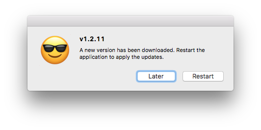

# 应用更新

本文讨论的是适用于个人非商业的electron应用更新机制。

应用的更新可以分为3个步骤：检测、下载、安装。`自动更新`包含了以上3部分，并且尽量避免用户参与这个过程，以防止打扰用户和降低学习成本。

## 简单方案

### 使用github检测更新

我们可以访问`api.github.com`（没有被局域网限制），来获取`latest release`的相关信息。

```
https://api.github.com/repos/{owner}/{repository}/releases/latest
```

当前应用的版本信息可以通过`app.getVersion()`来获取。

### 使用官方的自动更新功能

#### update-electron-app

[update-electron-app](https://github.com/electron/update-electron-app)是electron应用的官方更新实现，基于[update.electronjs.org](https://github.com/electron/update.electronjs.org)提供的更新服务。

我们可以[安装](https://github.com/electron/update-electron-app#installation)该更新实现，该实现在后台定时执行，并在检测到更新且下载更新后提示用户升级：



#### electron forge and Squirrel.Windows

如果我们使用的是`electron forge`并且使用的是`Squirrel.Windows`，会自动集成`Squirrel`提供的更新实现。

该实现也是基于`update.electronjs.org`提供的更新服务。

我们需要将使用`squirrel`打包得到的3个文件同时上传到Git Release中。

### 局域网下的简单方案

局域网对github进行了限速和拦截，无法使用git分发软件给局域网内的用户，也无法使用以上两个自动更新服务。

但是检测更新依然是可用的，可以选择显示检测结果并使用第三方（如网盘）进行分发。
