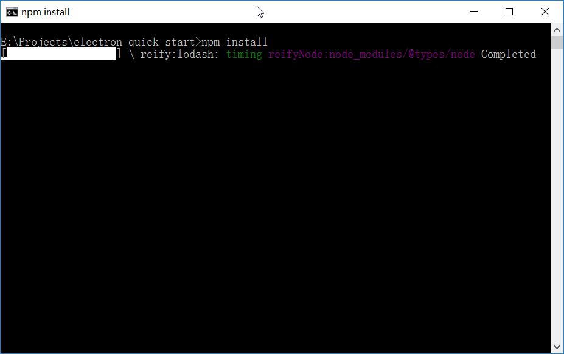

# 问题
由于局域网的原因，使用npm会存在网络问题，无论是直连、使用代理、使用镜像，执行`npm install`安装[electron-quick-start](https://github.com/electron/electron-quick-start)（electron官方示例程序）的依赖时，均会出现以下情况：



```
[##################] \ reify:lodash: timing reifyNode:node_modules/@types/node Completed
```

整个进程被阻塞，原因不明。

# 解决

只能通过[cnpm](http://cnpmjs.org/)来解决这个问题，但安全性又成了新的问题。